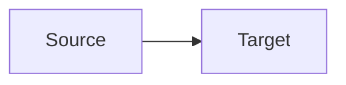

# Diagram Template

## Purpose

Use this template to document a Mermaid or architecture diagram. A diagram should visualize source documents and improve understanding; it should not become the only place where system knowledge exists.

## Template Body

````md
# Diagram: <Title>

## Diagram Type

System context | Container | Component | Sequence | Data flow | State | Other

## Purpose

Describe what this diagram helps readers understand.

## Scope

Level: Container | Direction: <name> | Service: <name>

Current state | Target state | Example | Mixed with labels

## Source Documents

- [<Document title>](<relative-link>)

## Mermaid



## Reading Notes

- <Note>

## Related Documents

- [<Document title>](<relative-link>)
````
